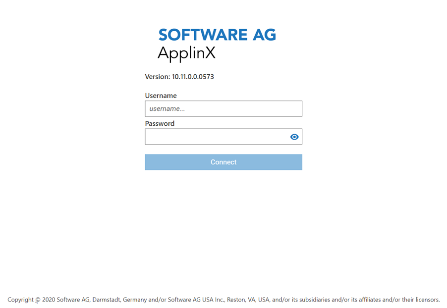
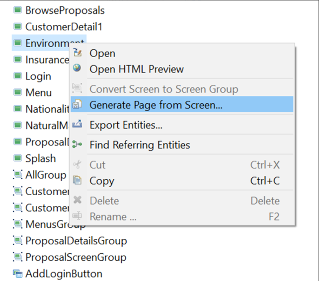
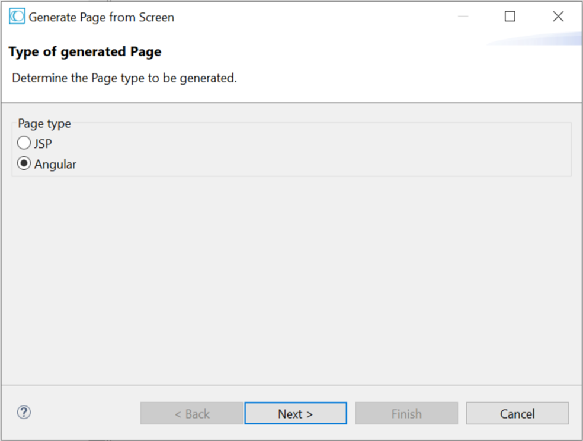
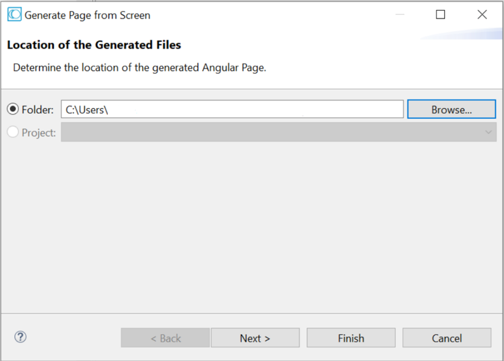
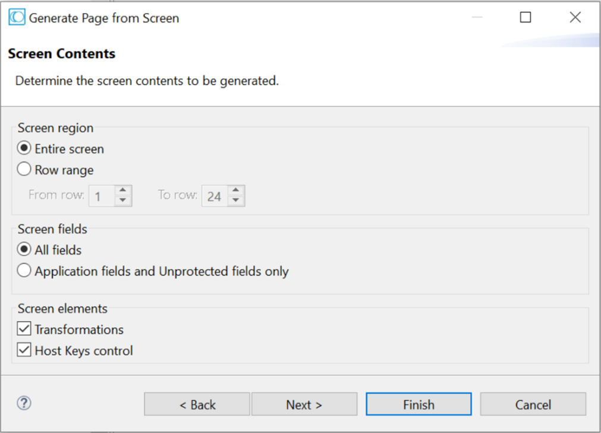
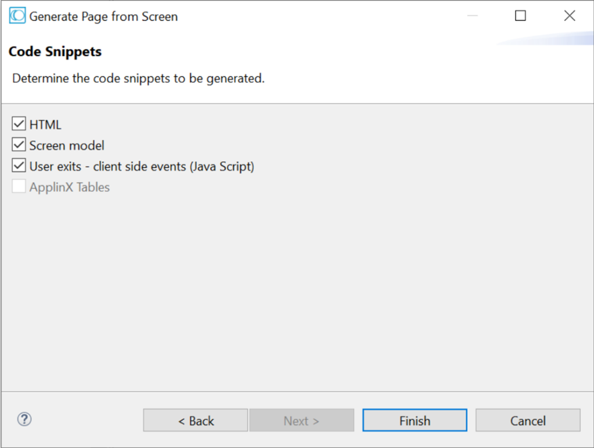
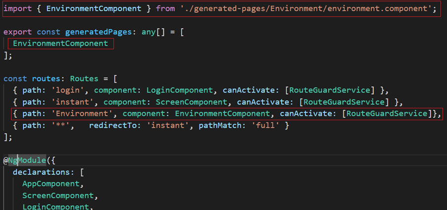

# ApplinX Angular Web Emulation

## Introduction

Free your legacy systems of green screens by turning them into modern-looking web applications.
Offering a wide range of modernization options, webMethods ApplinX gives you the freedom to create instant web apps on the fly or build composite applications using your own development environment and the front-end technology of your choice.
Quickly give your end users a better experience by using ApplinX to transform host screens into instant HTML pages. Start with simple web configurations and default wizard-based transformations to improve the look and feel of the application. 
Design a template with top and side images including company logo, and modify style sheets with different fonts, colors and more. 
Next, gradually customize your application - aggregate information from multiple core systems into one web page, integrate legacy assets on various levels (screen, transaction and data).  
This open source project is aimed to be used as a blueprint or an example for any customer implementation. It is implemented in Angular, but you can use this as a reference to your own implementation in any front-end technology. 
This implementation of the instant, on-the-fly conversion to HTML web application uses the ApplinX built-in REST APIs to communicate with the ApplinX server, which in turn communicates with the legacy host. 




## Prerequisites

* NodeJS (release builds are currently built with v12.19.0)

* NPM (Included with NodeJS)
  For more information on installing Node.js, see [nodejs.org](https://nodejs.org). 
  If you are unsure what version of Node.js runs on your system, run `node -v` in a terminal window.

* Angular CLI
  To install the Angular CLI, open a terminal window and run the following command:
  ```
  npm install -g @angular/cli
  ```


## ApplinX REST API Base Path

The Web Application communicates with the legacy host through ApplinX REST API. You may need to configure the REST API Base URL. 
To do this configure the *basePath* variable inside the files:

*	*<projectDir>/src/environments/environment.ts*
*	*<projectDir>/src/environments/environment.prod.ts*

Example: 
```
basePath: 'http://localhost:2380/applinx/rest'
```


## Installation

The ApplinX Angular web application can be compiled using the NPM and Node infrastructure. NPM third party packages need to be installed first. The following command will install the corresponding packages in *node_modules*:
```
npm install
```

After installing the NPM required packages, you will need to compile the web application, using the following command:
```
npm run build
```

The final Web Application will be in the *dist* directory and can be deployed to a Web Server.


## Features

* Instant Web Emulation: Quickly give your end users a better experience by using ApplinX to transform host screens into instant HTML pages. Start with simple web configurations and default wizard-based transformations to improve the look and feel of the application.*
* Configuration: allows for a basic session setting configurations.*
* Application Lifecycle Events: Various user exits that allow you to interact with the web application on different lifecycle stages.*
* Generated Pages: When the Instant Web Application, which enables enhancements such as relatively simple visual changes, does not meet all the requirements, it is recommended to generate Angular pages that can be modified, customized or further enhanced.*
* Keyboard Mappings: Page specific actions can be mapped to a keyboard key (or to a combination of two keyboard keys).*
* Logger: *Pretty-print & Server-side logging available.*


## Configuration

The Web Application contains a configuration file under following path: 
> \<projectDir\>/src/assets/config/sessionConfig.json

*_Required_.

| Name        | Description  |
| ------------- |:-------------:|
| __*__ applicationName | The name of the application that the session will be connected to. |
| connectionPool   | Connection Pool enable to immediately get a host connection that is ready in a specific screen. |
| logger           | see logger table below |
| sessionOptions   | Controlling the Connection Properties. ApplinX allows passing various connection parameters from the code in order to control the configuration of the application. For example: Controlling from the code if the application will work against a trace file. |

### Logger

| Name        | Description  |
| ------------- |:-------------:|
| level (number) | only log messages of this level or higher (OFF disables the logger for the client). |
| serverLogLevel (number) | only send log messages of this level or higher to the server (OFF disables the logger for the server). |
| disableConsoleLogging (Boolean) | disables console logging, while still alerting the log monitor. |

***Log levels:***
TRACE=0, DEBUG=1, INFO=2, LOG=3, WARN=4, ERROR=5, FATAL=6, OFF=7


## Generated Pages

When the Instant Web Emulation, which enables enhancements such as relatively simple visual changes do not meet all the requirements, it is recommended to generate Angular page components that can be modified, customized or further enhanced. 
Angular pages can be generated using ApplinX’s Designer.

### Recommendation

It’s recommended to use development server in the process of building and customizing the Web Application with Generated Pages. Angular’s development server automatically rebuilds the application and reloads the page when you change any of the source files, so you will not need to rebuild and redeploy your application to a Web Server after every small change but only when the development finished.
To build and serve your Angular project on a development server, go to the project parent directory and run the command: 
```
ng serve 
```
If it does not work, try the command:
```
npm run ng serve
```

***Generating an Angular page component***

1.	Right-click on the relevant screen in the ApplinX Explorer and select ***Generate Page from Screen…*** 



2.	Choose **Angular** as Page type



3.	Determine the folder where the generated page will be placed. 
The generated pages should be placed under the following path:

> \<projectDir\>/src/app/generated-pages`



4.	Click **Next**. The Screen Contents screen is displayed.


5.	Determine the region in the screen that is to be generated: this can be the entire screen or a specific range of rows.
6.	Determine the type of fields that are to be generated: all the fields or only application and unprotected fields.
7.	Determine whether the host keys control and/or transformations are to be generated.
8.	Click **Next**. The *Code Snippets* screen is displayed.



9.	In the Code Snippets tab define the elements you would like to generate code help notes for. 
The snippets contain code which can be used as a basis for further development. Click **Finish**.


### Add Generated Page declaration and routing

Like any Angular component, the generated page should be declared in a *NgModule*.
The generated page should be declared within:

> \<projectDir\>/app/src/app.module.ts

Also, a route for the component should be configured. All of this takes 3 steps.
Let’s showcase the required configuration with an example of Generated Page titled ***‘Environment’***:



***Details, as marked with RED rectangles:***
1.	The Component was imported.
2.	The Component was added to the ***‘generatedPages’*** array.
3.	The Component was mapped to the *‘Environment’* route. This way when a screen with the name *‘Environment’* arrives in the session, the Web Application will load the *EnvironmentComponent*.


### Generated Page structure

Each Generated Page is composed from four files:
1.	*\<pageName\>.component.html*:  The view template.
2.	*\<pageName\>.component.ts*:  The component's logic (TypeScript / JavaScript).
3.	*\<pageName\>.model.ts*: The host screen data. The building blocks of the screen.
4.	*\<pageName\>.component.css*: Specific styling for the page can be added here.
The Generated Page purpose is to be modified for UI enhancements and therefore any appropriate logic can be added to each part of the component.
For instance, pure HTML elements and other Angular components can be added in the view template and customized logic can be implemented in the _\<pageName\>.component.ts_ file

### Generated Page screen model

Each Generated Page contains a TypeScript class named *\<pageName\>.model.ts*.
This class holds the screen representation with the protected / unprotected fields and ApplinX transformations if defined. 
We use the {runtime} token to indicate that the field content will be taken dynamically at runtime. If you want to change the content of the field to a predefined static value remove the {runtime}  token.
The user can add/remove/modify the screen size, transformations, protected/unprotected fields, etc...

### Generated Page layout

Generated Page structure is based on ***CSS Grid Layout***, which is a two-dimensional grid-based layout system.

**Terminology**:

*Grid Container*: Each screen is represented by a div element which `display: grid` is applied on. The Grid Container dimensions are determined by the screen size.
*Grid Item*: The children (i.e. direct descendants) of the grid container. Here the protected / unprotected fields are grid items. The field position in the grid is determined according to the position in the host using the following properties:
- `grid-column-start`: The field starting column position.
- `grid-column-end`: field position + field length.
- `grid-row-start`: The field row position.
- `grid-row-end`: Same as row-start (field can only capture one row).


## Application Lifecycle Events (User Exits)

An event is a procedure of the application engine that informs you that a certain process occurred, and consequently allows you to capture this event and react with your own code. The ApplinX events are called by the ApplinX framework building blocks.

### ApplinX events

```
    /**
     * Occours before and after connecting a session with host through LoginComponent.onConnect()
     */
    preConnect(createSessionRequest: CreateSessionRequest, authHeader?: string);
    postConnect(createSessionRespose: CreateSessionResponse);
    onConnectError(errorResponse: HttpErrorResponse);
```
```
    /**
     * Occurs before and after getting host screen through ScreenComponent.getScreen()
     */
    preGetScreen(getScreenRequest: GetScreenRequest);
    postGetScreen(GetScreenResponse: GetScreenResponse);
    onGetScreenError(errorResponse: HttpErrorResponse);
```
```
    /**
     * Occurs before and after updating host screen through NavigationService.sendKeys(sendKey: string)
     */
    preSendKey(sendKeysRequest: SendKeysRequest);
    postSendKey(sendKeysResponse: any);
    onSendKeyError(errorResponse: HttpErrorResponse);
```
```  
    /**
     * Occurs before and after disconnecting a session with host.
     */
    preDisconnect();
    postDisconnect(disconnectSessionRespose: CreateSessionResponse);
    onDisconnectError(errorResponse: HttpErrorResponse);
```
```
    /**
     * Occurs after screen fully initialized in the DOM. User can access and manipulate the DOM, fill HTML input fields by id, etc...
     */
    afterViewInit();
```
### Execution order

* preConnect
* postConnect / onConnectError
* preGetScreen
* postGetScreen / onGetScreenError
* afterViewInit
* preSendKey
* postSendKey / onSendKeyError

### Generated Page User Exits

Each generated page can have his own User Exits code. Just uncomment the User Exits code according to the *code snippets* in the generated page component.
i.e., your generated page will contain the following instructions:

> \// Uncomment the following line to add user exits for the current page.

### Generated Page CSS file
To add style attributes to HTML elements (custom elements that added in the page view template file) in the generated page CSS file use the following syntax:
```
	::ng-deep #fieldID {
		color: red; 
	}
```


## Keyboard Mapping

Page specific actions can be mapped to a keyboard key (or to a combination of two keyboard keys) using the following methods:

* Inject JS function within class ‘LifecycleUserExits.ts’ in method ‘afterViewInit’.

Example one:
```
	this.addKeyboardMapping(GXAdditionalKey.NONE, GXKeyCodes.F4, function(){
		console.log(‘hello world!’);
	}, true);
```

Example two (using arrow function):
```
	this.addKeyboardMapping(GXAdditionalKey.SHIFT, GXKeyCodes.F3, () => alert(`Hello world`), true);
```

* Using keyboard mapping config file under:
> \<projectDir\>/src/assets/config/KeyboardMappings.json


**Note**: Additional information can be found in ApplinX documentation.
From the top-level ApplinX User Guide screen, choose Reference > Web Application Development > API References > Client Side (JavaScript) > Keyboard Mapping.

